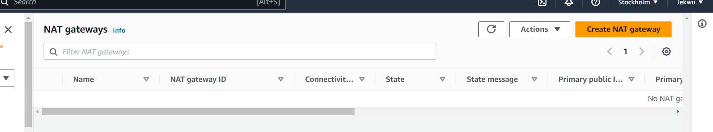
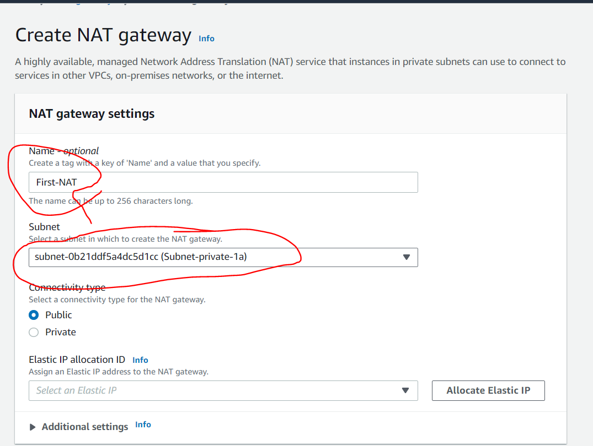
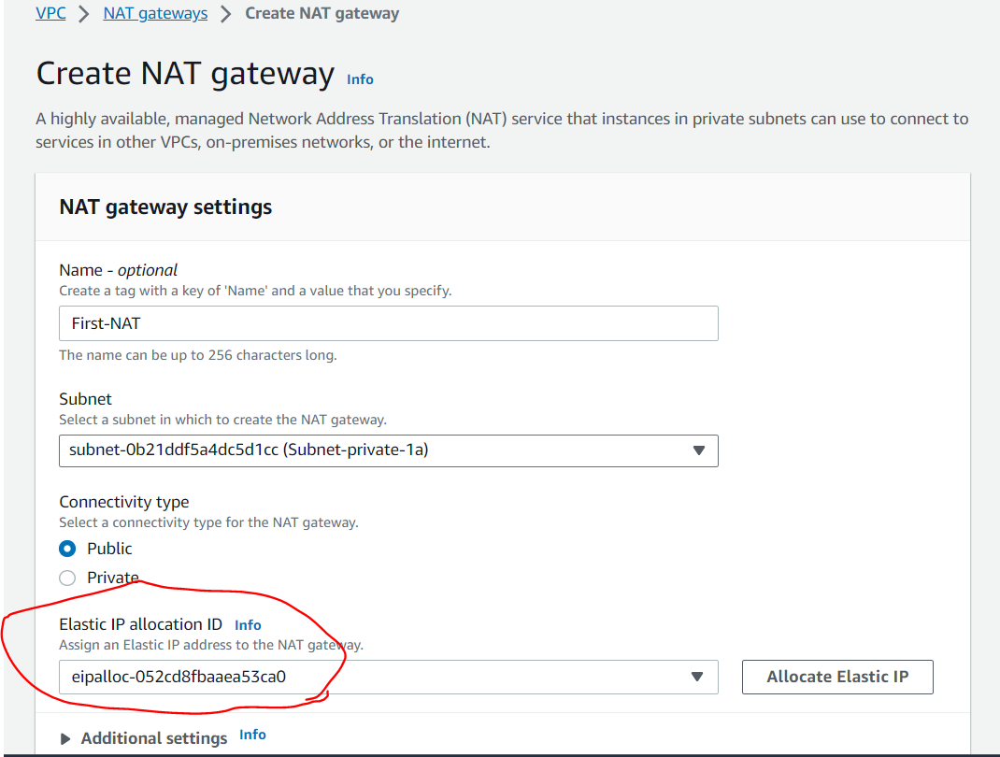
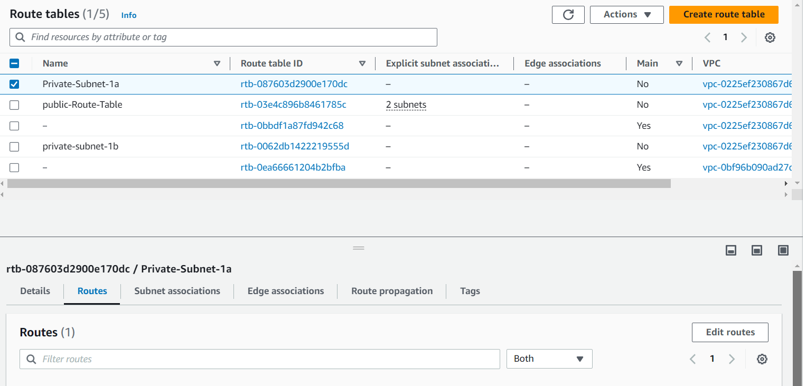
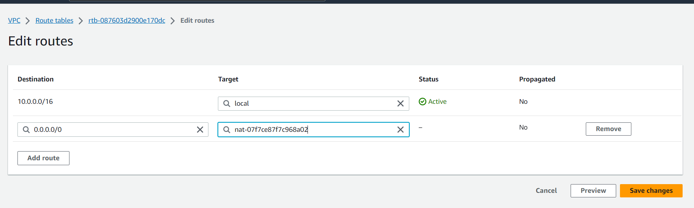
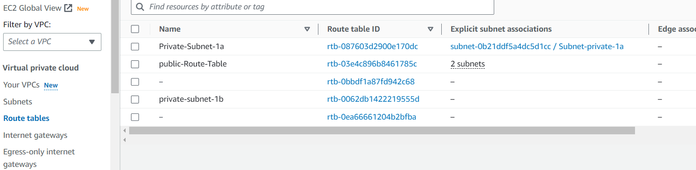
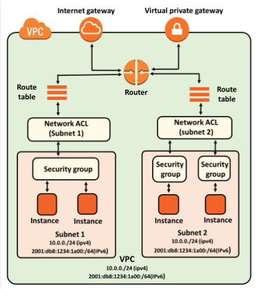
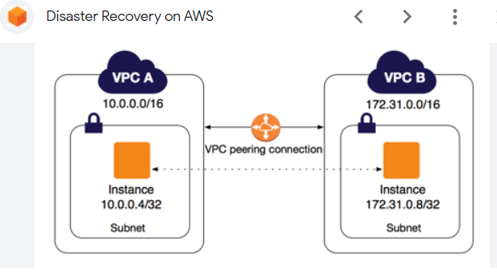
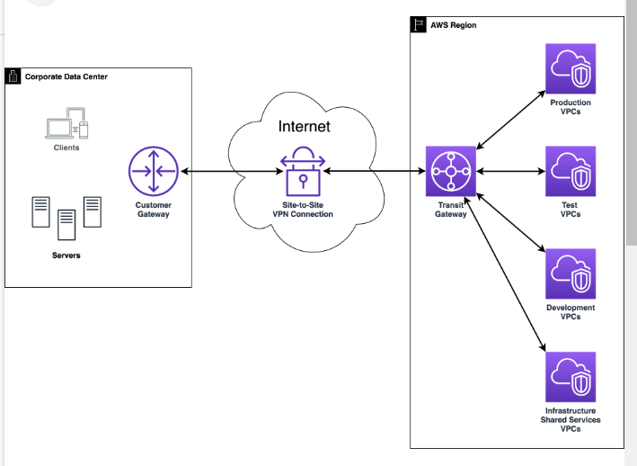
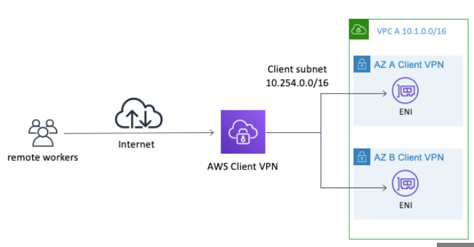

                          AWS NETWORKING IMPLEMENTATION-VPC

We will choose VPC only for this project and later choose VPC and more in another project.
We choose "first-VPC" as the tag name and "10.0.0.0/16" as the CIDR for this project.

CREATE VPC;
A VPC is an isolated portion of the AWS cloud populated by AWS objects such as instances.

As soon as the VPC is created, it is assigned with vpc-id and there is a route table created that serves as the main route table as highlited below;
!

We have now a VPC and route table, but at the moment we can not put anything inside it now. We can only put something there until we have created subnets and configured it.

CREATING AND CONFIGURING SUBNETS:

Subnets are like smaller segments within a VPC that help you organize and manage your resources.

Remember to put the diagram here:

Go to VPC > Subnet > Create Subnet > and select the VPC that you have created previously -the "First-VPC" as tagged in my project.

Enter the subnet settings detail. Do not click Create Subnet button yet, click the add new subnet button to add the remaining subnets then after completing all the required subnets, click create subnets. Remeber to choose availability zone otherwise it will randomly chosse it for you.

NB: Use public subnet for resources that need internet access and private subnet for resources that you want to keep private.

                 INTERNET GATEWAY AND ROUTING TABLE
Go to VPC > Internet gateway and click Create Internet Gateway

Then Attach as highklited above;

                      CREATING AND CONFIGURING ROUTING TABLES
Now that we have our Internet Gateway attached to the VPC, it is time to give directions to our resources. 
This is done through a Routing Table.

Public Subnet TRoute Table;
Go to VPC, Click Route Table > Create route table

Then immediately created, edith the route table, add a default route to the internet gateway.

Then go to subnet association tab and Edit subnet association, select the public subnets and click 
save association:

CREATE PRIVATE SUBNET ROUTE TABLES;
gO TO ROUTE TABLE AND CLICK ON THE WRITE TABLE:

                         NAT GATEWAY 
A NAT Gateway  acts like a secure door that only opens one way. It allows your resources inside
the private subnet to access the internet for things like update and downloads, but it does not 
allow anything from the internet to enter your private subnet.

NAT allows instances in the private subntes to connect to outside services like Databases but restricts external services to connecting to these instances.

Go to VPC > and Click "Create NAT Gateway"

Create the NAT GATEWAY and name it "First-NAT" under one of the private subnets which I choose the subnte-private-1a as the subnet.

We need to allocate Elastic IP because it is required for the creation of NAT Gateway.

Go to Route table menu  and Create a route table for the private subnets and edit the route table, add default route to the NAT Gatway.

To edit the route table, select the route tab, and select Add Route. Under the target, select the NAT Gateway named "First-NAT"

Next go to the subnet associations tab and click "Edith subnet association"

                                  Security Group and Network ACLs
Security groups and Network access control lists ACLs are both important tools for securing our network on the AWS cloud, but they serve different purposes and have different use cases.

It is importatnt to note that security group opeartes at the instance level, that is providing security to the immediate instance it is applied on. 

NACL provide security at the subnet level, meaning that they will protect all the instances in the subnet it is applied on.

                                 VPC Peering and VPN
VPC Peering is a networking feature that allows you to connect two VPCs within the same cloud providers network or accross different regions. 
VPC Peering enable direct communication between VPCs, allowing resources in each VPC to interact with each other as if they were in on the 
same network. It provide secure and direct communication between VPCs without the need for internet. VPC Peering is commonly used to establish
connectivity between VPCs in scenarios such as muti-tier applications, resource sharing, or data replication.

VPN connections establish a secure and encrypted communication channel between your on-premises network and a cloud providers' network, such as VPC. VPN connections enable secure access to resources in the cloud from remote locations or connect on-premises networks with cloud resources.

There are two primary types of VPN connections:
1. SIte-to-Site VPN: This type of VPN establishes a secure connection between your on-premises network and the cloud provider's network. It allows communication between your on-premises resources and resources in the VPC securely and privately. This type of connection is commonly used in hybrid cloud architectures.

2. AWS Client VPN: This provides secure remote access to the cloud network for individuals users or devices. It enables secure connectivity for remote employees, partners, or contractors to access resources in the VPC securely.

