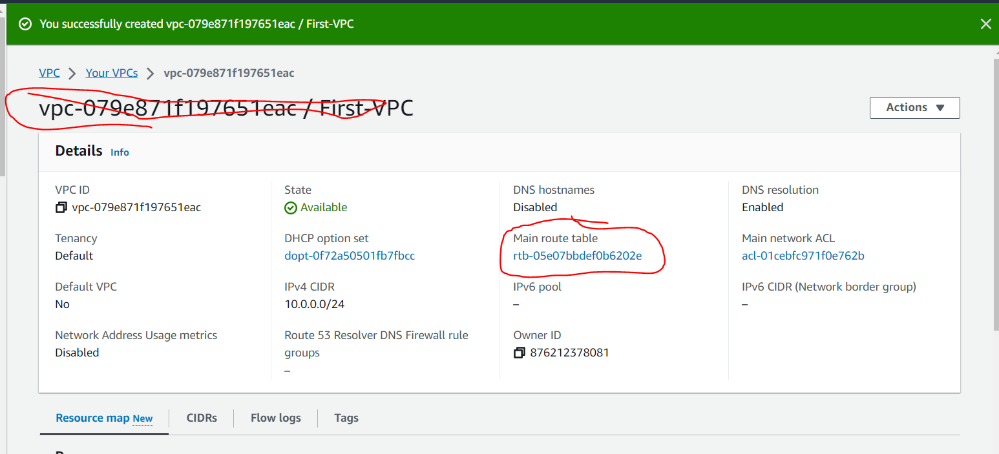

                          AWS NETWORKING IMPLEMENTATION-VPC

We will choose VPC only for this project and later choose VPC and more in another project.
We choose "first-VPC" as the tag name and "10.0.0.0/16" as the CIDR for this project.

CREATE VPC;
A VPC is an isolated portion of the AWS cloud populated by AWS objects such as instances.

As soon as the VPC is created, it is assigned with vpc-id and there is a route table created that serves as the main route table as highlited below;

We have now a VPC and route table, but at the moment we can not put anything inside it now. We can only put something there until we have created subnets and configured it.

CREATING AND CONFIGURING SUBNETS:

Subnets are like smaller segments within a VPC that help you organize and manage your resources.

Remember to put the diagram here:

Go to VPC > Subnet > Create Subnet > and select the VPC that you have created previously -the "First-VPC" as tagged in my project.
