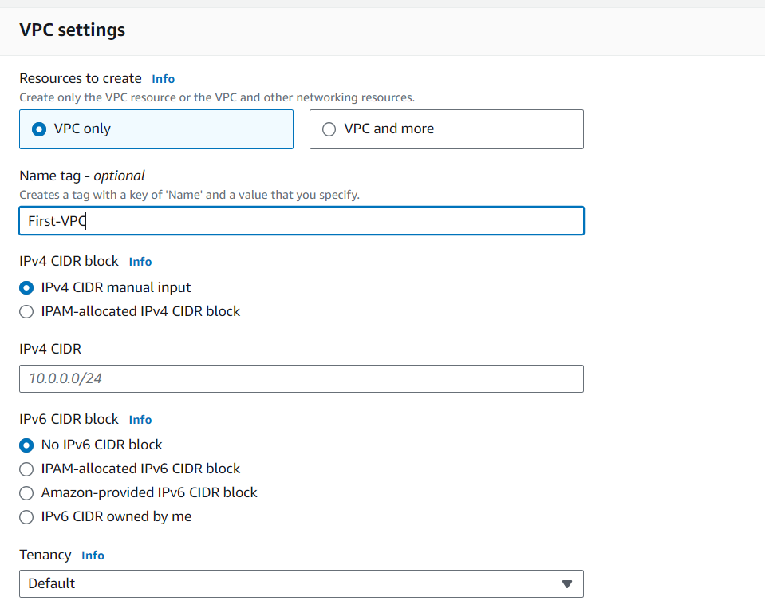
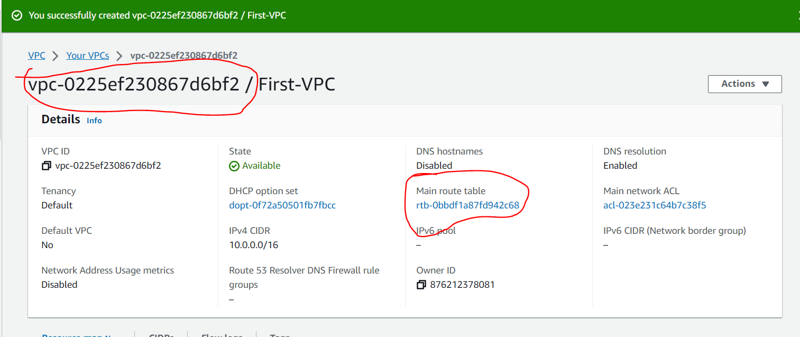
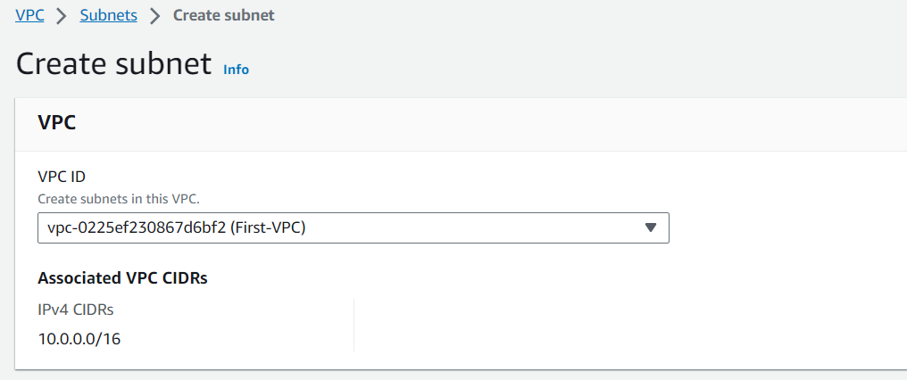
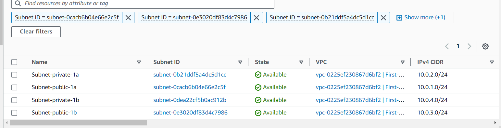
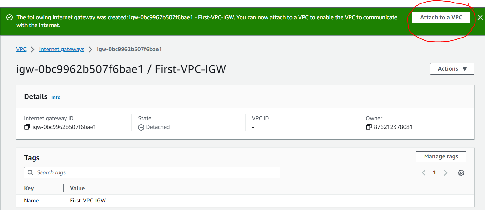
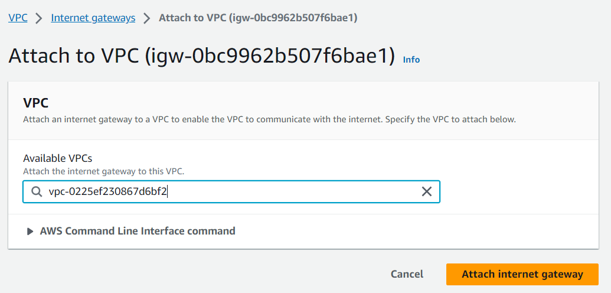
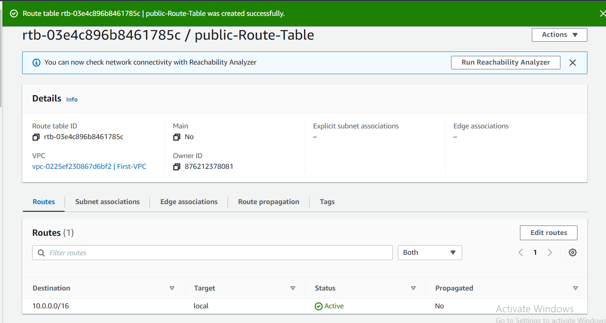
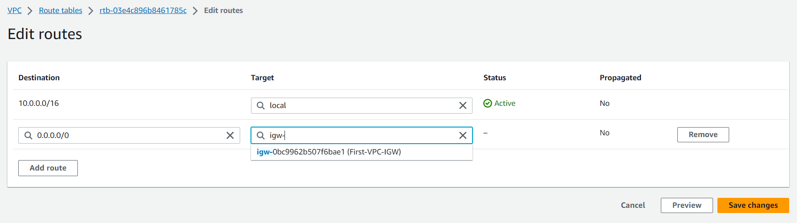
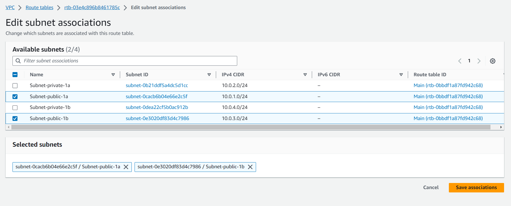
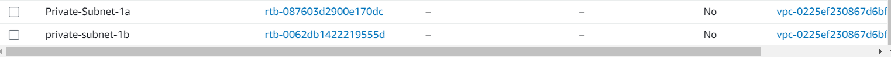

                          AWS NETWORKING IMPLEMENTATION-VPC

We will choose VPC only for this project and later choose VPC and more in another project.
We choose "first-VPC" as the tag name and "10.0.0.0/16" as the CIDR for this project.

CREATE VPC;
A VPC is an isolated portion of the AWS cloud populated by AWS objects such as instances.

As soon as the VPC is created, it is assigned with vpc-id and there is a route table created that serves as the main route table as highlited below;
!

We have now a VPC and route table, but at the moment we can not put anything inside it now. We can only put something there until we have created subnets and configured it.

CREATING AND CONFIGURING SUBNETS:

Subnets are like smaller segments within a VPC that help you organize and manage your resources.

Remember to put the diagram here:

Go to VPC > Subnet > Create Subnet > and select the VPC that you have created previously -the "First-VPC" as tagged in my project.

Enter the subnet settings detail. Do not click Create Subnet button yet, click the add new subnet button to add the remaining subnets then after completing all the required subnets, click create subnets. Remeber to choose availability zone otherwise it will randomly chosse it for you.

NB: Use public subnet for resources that need internet access and private subnet for resources that you want to keep private.

                 INTERNET GATEWAY AND ROUTING TABLE
Go to VPC > Internet gateway and click Create Internet Gateway

Then Attach as highklited above;

                      CREATING AND CONFIGURING ROUTING TABLES
Now that we have our Internet Gateway attached to the VPC, it is time to give directions to our resources. 
This is done through a Routing Table.

Public Subnet TRoute Table;
Go to VPC, Click Route Table > Create route table

Then immediately created, edith the route table, add a default route to the internet gateway.

Then go to subnet association tab and Edit subnet association, select the public subnets and click 
save association:

CREATE PRIVATE SUBNET ROUTE TABLES;
gO TO ROUTE TABLE AND CLICK ON THE WRITE TABLE:

               NAT GATEWAY AND PRIVATE SUBNETS

